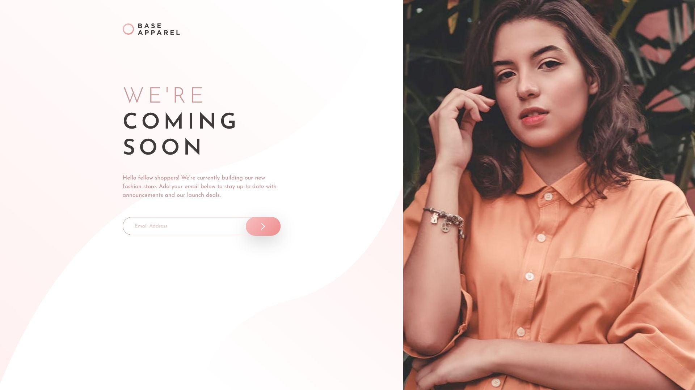
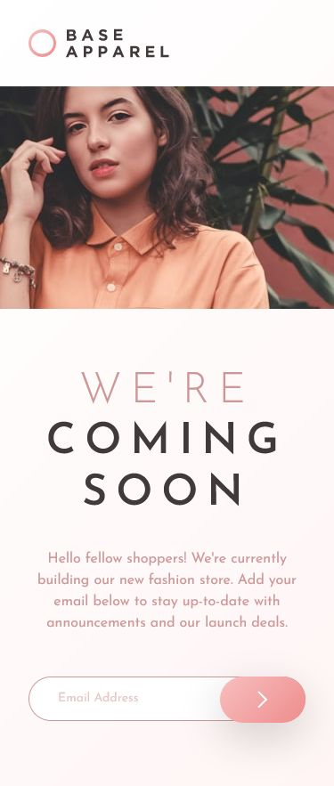

# Frontend Mentor - Base Apparel coming soon page solution

This is a solution to the [Base Apparel coming soon page challenge on Frontend Mentor](https://www.frontendmentor.io/challenges/base-apparel-coming-soon-page-5d46b47f8db8a7063f9331a0). Frontend Mentor challenges help you improve your coding skills by building realistic projects.

## Table of contents

- [Overview](#overview)
  - [Screenshot](#screenshot)
  - [Links](#links)
- [My process](#my-process)
  - [Built with](#built-with)
  - [What I learned](#what-i-learned)
- [Author](#author)

## Overview

Hi! This is my attempt at the Base Apparel Coming Soon page. This challenge was fairly straightforward and simple. For previous challenges I had been using SASS, but I decided to attempt this one using just pure CSS to strengthen my fundamentals and to be able to write clean CSS.

### Screenshot

Desktop

Mobile

### Links

- Solution URL: [Here!](https://github.com/sheronimo/frontendmentor-baseapparel)
- Live Site URL: [Here!](https://sheronimo.github.io/frontendmentor-baseapparel/)

## My process

1. I restructured the markup for the entire page, with room to add/remove wrappers when working on the styling.
2. I first worked on the styling as it would look on large screens, then the form validation scripts to ensure that the form validation (appearance of errors) would not cause any of the styling to break.
3. After making final tweaks to the large screen styling, I then worked on the styling for small screens.

### Built with

- Semantic HTML5
- Flexbox
- Javascript form validation
- Regex for validating email pattern

### What I learned

I learned about how to manage showing and hiding certain items depending on the screen size.

## Author

- Github - [sheronimo](https://github.com/sheronimo)
- Frontend Mentor - [@sheronimo](https://www.frontendmentor.io/profile/sheronimo)
